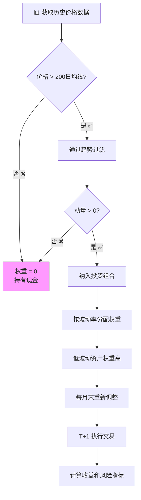
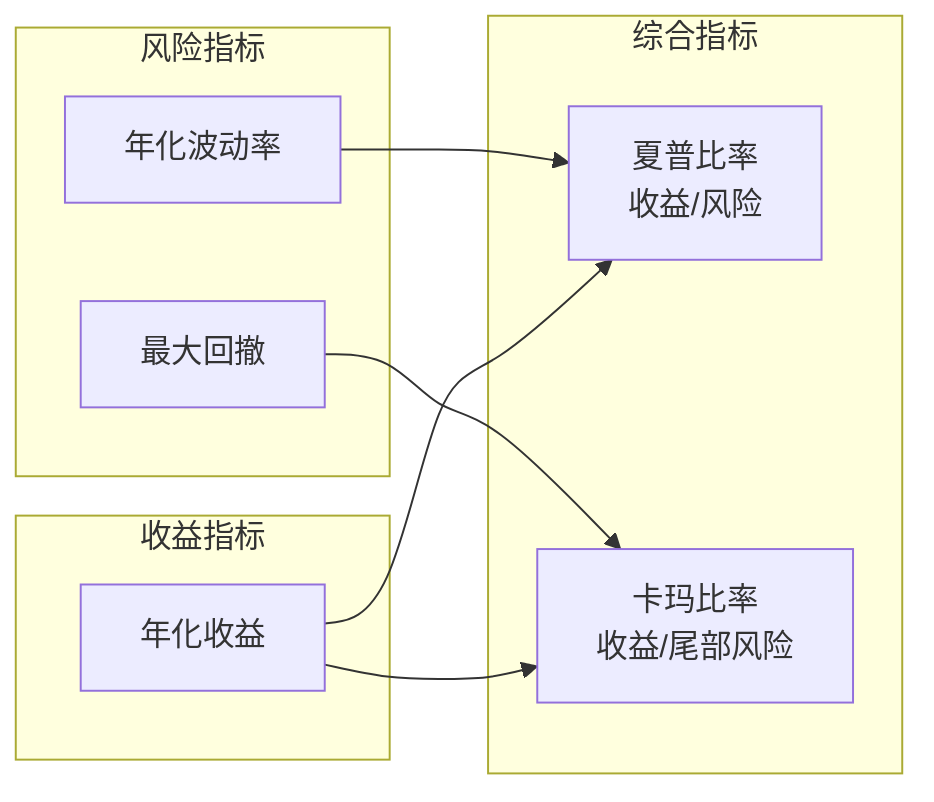

# ETF Trend Following Backtester

基于动量和趋势过滤的 ETF 投资组合策略回测系统。

---

## 📚 这个项目是做什么的？

这个项目帮助你**模拟测试一个投资策略**，看看如果你从过去某个时间点开始用这个策略投资，到现在会赚多少钱（或亏多少钱）。

### 核心概念解释

| 术语                | 通俗解释                                                                                        |
| ------------------- | ----------------------------------------------------------------------------------------------- |
| **ETF**             | 一篮子股票打包成一个产品，买一份 ETF 就等于同时买了很多股票。比如 SPY 代表美国最大的 500 家公司 |
| **回测 (Backtest)** | 用历史数据模拟"如果当时这样投资会怎样"，类似于"事后诸葛亮"                                      |
| **动量 (Momentum)** | 最近涨得好的东西往往继续涨，最近跌的往往继续跌                                                  |
| **趋势 (Trend)**    | 价格的长期方向，上升趋势意味着整体在涨                                                          |

---

## 🔄 策略工作流程



### 策略特点

> **只做多 (Long-Only)**: 本策略只买入资产，不做空。当资产不满足条件时，该资产权重为 0，相当于持有现金。如果所有资产都不满足条件，则 100% 持有现金。

1. **只买上涨趋势的资产** - 价格在 200 天平均价格之上
2. **只买最近表现好的** - 动量为正
3. **稳定的多投，波动大的少投** - 反向波动率加权
4. **每月调整一次** - 不需要天天盯盘
5. **不满足条件则持有现金** - 自动避险

---

## 📈 输出图表解读

运行回测后会生成 4 张图表：

### 图表 1: Normalized Adj Close (归一化价格)

```
用途: 比较不同资产的涨跌幅度
解读: 所有资产从 100 开始，最后谁高谁涨得多
```

- 如果 SPY 从 100 涨到 300，表示涨了 200%
- 所有资产统一起点，方便比较

### 图表 2: Portfolio Weights (投资组合权重)

```
用途: 显示每个月钱是怎么分配的
解读: 不同颜色代表不同资产，高度代表占比
```

- 如果 SPY 占 40%，表示 100 块钱中 40 块买了 SPY
- 空白区域表示持有现金（没有符合条件的资产）

### 图表 3: Strategy vs Benchmark (策略 vs 基准)

```
用途: 你的策略和"什么都不做只买 SPY"的对比
解读: 策略线在上方 = 跑赢市场，在下方 = 跑输市场
```

- **理想情况**: 策略线始终在上方
- **糟糕情况**: 策略线始终在下方

### 图表 4: Drawdown (回撤)

```
用途: 显示从最高点跌了多少
解读: 越深表示亏损越大，越浅越好
```

- 回撤 -20% 意味着如果最高时有 100 万，现在只剩 80 万
- 投资者通常最怕大回撤

---

## 📊 绩效指标解读

运行后会输出类似这样的数据：

```
Ann Return            0.003607    # 年化收益率
Ann Vol               0.028755    # 年化波动率
Sharpe                0.139592    # 夏普比率
Max Drawdown         -0.080382    # 最大回撤
Calmar                0.044867    # 卡玛比率
Avg Daily Turnover    0.054713    # 平均日换手率
Avg Cost (bps/day)    0.109426    # 平均日交易成本
```

### 指标含义与评估方法

| 指标                        | 含义                     | 如何评估                                   |
| --------------------------- | ------------------------ | ------------------------------------------ |
| **Ann Return (年化收益)**   | 平均每年赚多少           | 与基准 (SPY) 相比是否有超额收益            |
| **Ann Vol (年化波动)**      | 每年涨跌的剧烈程度       | 是否在个人风险承受范围内                   |
| **Sharpe (夏普比率)**       | 承担一份风险获得多少回报 | 滚动 Sharpe 是否稳定，是否长期退化         |
| **Max Drawdown (最大回撤)** | 最惨的时候亏了多少       | 是否在可承受范围内（通常 -20% 是心理门槛） |
| **Calmar (卡玛比率)**       | 年化收益 / 最大回撤      | 综合评估收益与尾部风险，越高越好           |

> ⚠️ **注意**: 没有绝对的"好"或"坏"标准。指标需要结合市场环境、投资周期、个人风险偏好综合判断。同一策略在牛市和熊市的表现可能截然不同。



---

## ⚠️ 假设与局限性

本回测系统基于以下简化假设，实际交易中可能存在差异：

| 假设         | 说明                                                        |
| ------------ | ----------------------------------------------------------- |
| **数据源**   | 使用 Tiingo adjusted close（已调整分红、拆股）              |
| **执行时机** | 月末计算信号，T+1 以收盘价执行（`weights.shift(1)`）        |
| **交易成本** | 简化模型：`turnover × cost_bps`，**不含滑点和市场冲击成本** |
| **流动性**   | 假设可以按收盘价无限量成交，不考虑大额订单对价格的影响      |
| **现金收益** | 持有现金期间收益为 0，未计入货币基金利息                    |

---

## 🗺️ Roadmap

后续可能增加的功能：

- [ ] **Vol Targeting** - 组合层面动态杠杆，真正达到目标年化波动率
- [ ] **Top-N 筛选** - 横截面动量排序，只持有前 N 名资产
- [ ] **Regime Filter** - 根据宏观环境（VIX、利率曲线）动态调整敞口
- [ ] **多数据源支持** - 接入 Polygon 实时数据，支持盘中执行
- [ ] **滑点模型** - 更真实的交易成本估计

---

## 🚀 快速开始

### 安装依赖

```bash
uv sync
```

### 🏃 常用命令 (Daily Usage)

**1. 生成最全面投资报告 (每周推荐)** 🌟

这是**首选命令**，生成包含所有功能的完整 PDF 报告：

```bash
uv run python -m etf_trend.scripts.weekly_report --out weekly_full.pdf
```

- **市场状态**: Risk On/Off 判断
- **ETF 核心配置**: 基于最小方差优化的权重
- **个股卫星推荐**: Top-10 多因子精选个股
- **交易执行计划**: 入场点、止损点、移动止损 (新功能 🆕)
- **AI 深度分析**: 自动解读市场趋势

**2. 个股推荐 (含多级买卖点)** 🛰️

输出个股推荐，每只股票包含 **3 入场 / 3 止损 / 3 止盈** 共 9 个价位：

```bash
uv run python -m etf_trend.scripts.stock_picks
```

**3. 运行历史回测 (Backtest)** 📜

验证策略在过去 10+ 年的表现（不含个股）：

```bash
uv run python -m etf_trend.scripts.export_report --out backtest_report.pdf
```

**4. 每日市场信号 (Daily Signal)** ⚡

快速检查今日市场状态和风险预算：

```bash
uv run python -m etf_trend.scripts.daily_signal
```

> 💡 **提示**: 使用 AI 分析需在 `.env` 中配置 `LLM_API_KEY`。

---

## 🧪 开发命令

```bash
# 运行测试
uv run pytest tests/ -v

# 代码格式化
uv run black src/ tests/
```

---

## ⚙️ 配置

配置文件: `src/etf_trend/configs/default.yaml`

### ETF 资产池

| 类型   | ETF                                               | 说明      |
| ------ | ------------------------------------------------- | --------- |
| 股票类 | SPY, QQQ, IWM, MTUM, XLK, XLF, XLV, XLE, XLI, XLY | 大类+行业 |
| 防守类 | TLT, IEF, GLD                                     | 债券+黄金 |

### 个股池（卫星持仓）

| 行业 | 股票                                                                          |
| ---- | ----------------------------------------------------------------------------- |
| 科技 | AAPL 苹果, MSFT 微软, GOOGL 谷歌, AMZN 亚马逊, META, NVDA 英伟达, TSLA 特斯拉 |
| 消费 | WMT 沃尔玛, HD 家得宝, MCD 麦当劳, COST 好市多                                |
| 金融 | JPM 摩根大通, V Visa, MA 万事达                                               |
| 医疗 | JNJ 强生, UNH 联合健康                                                        |

### 市场状态机参数

| 参数            | 默认值 | 说明             |
| --------------- | ------ | ---------------- |
| ma_window       | 200    | 长期趋势均线天数 |
| momentum_window | 60     | 中期动量计算天数 |
| vix_threshold   | 20     | VIX 恐慌阈值     |

### 数据源

| 用途     | 数据源        | 说明                |
| -------- | ------------- | ------------------- |
| ETF/个股 | Yahoo Finance | 免费，无需 API 密钥 |
| 备用     | Tiingo        | 需 API 密钥，有限流 |
