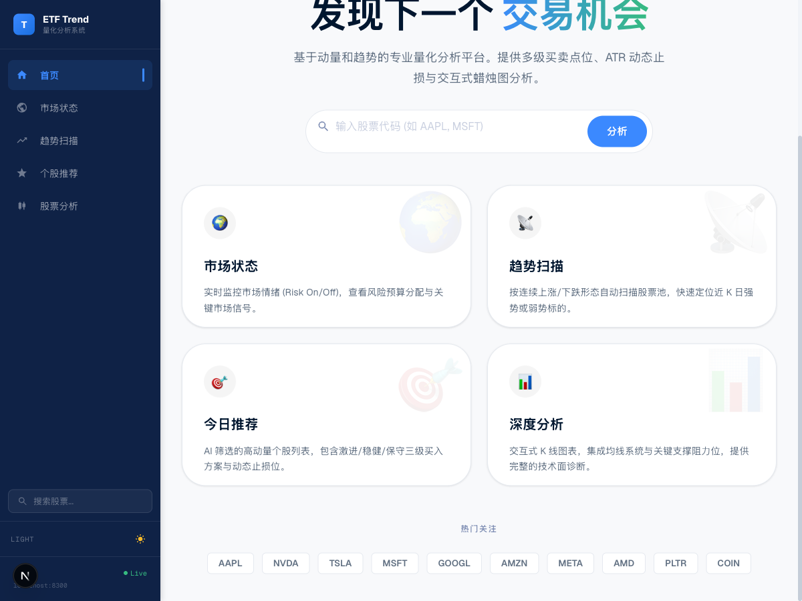
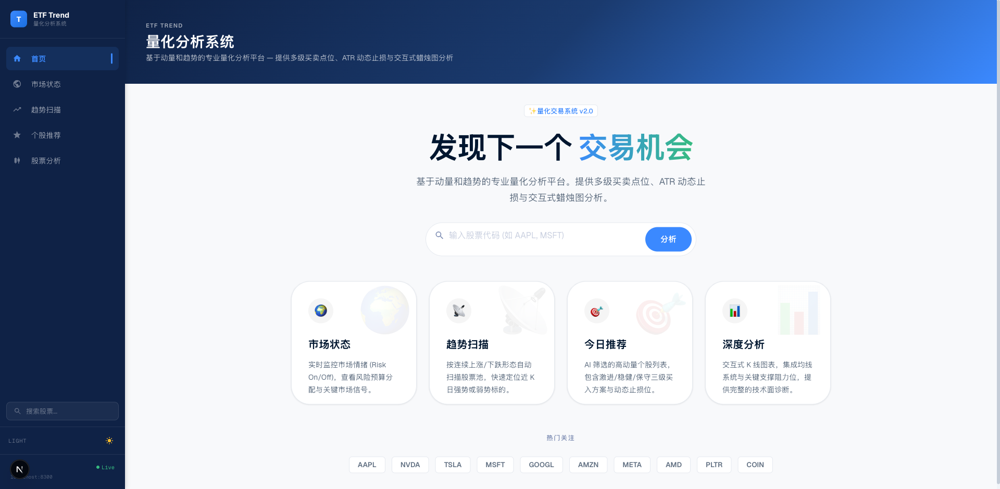
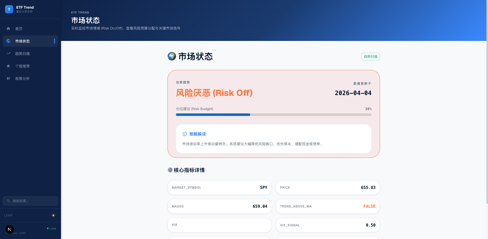
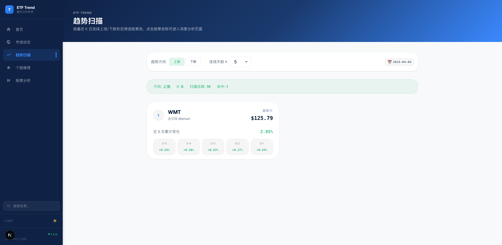
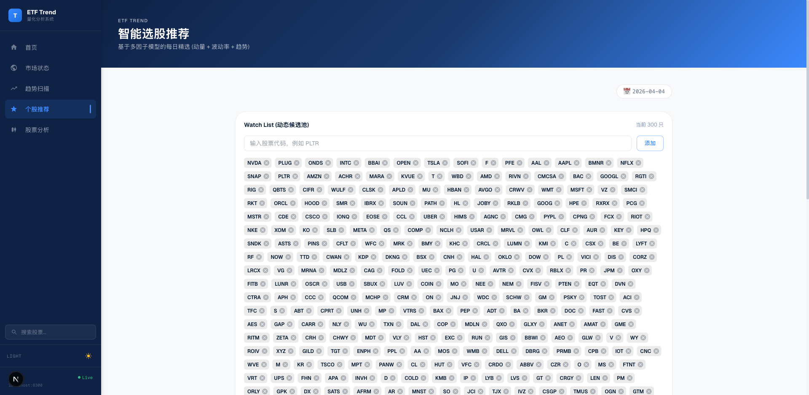
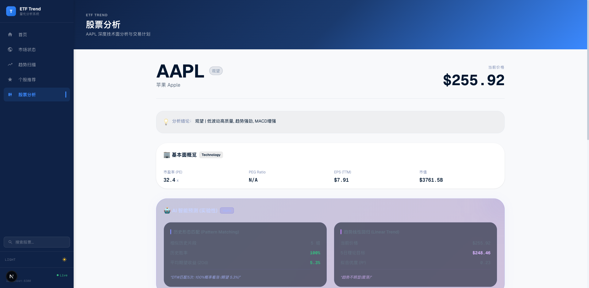
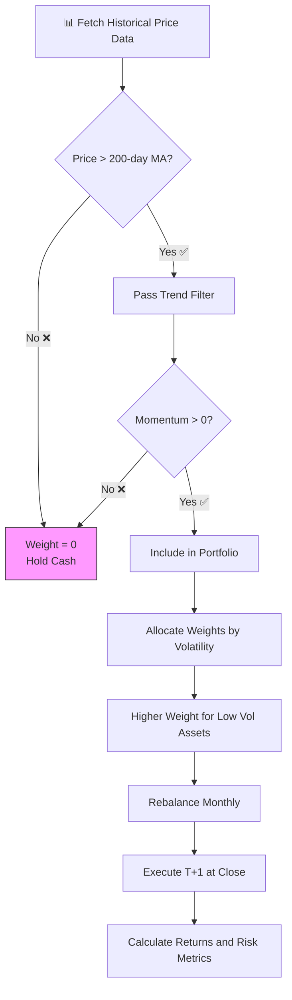
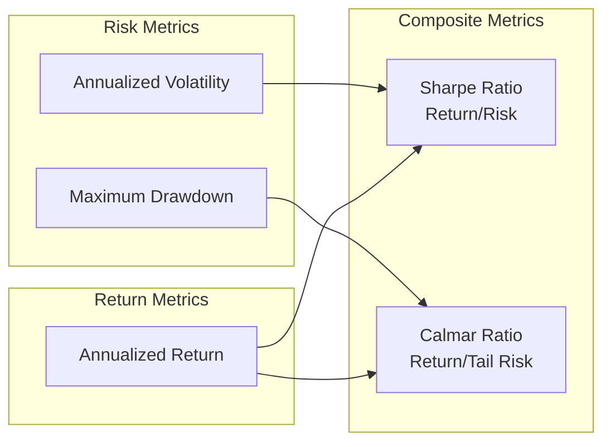

<div align="center">

# ETF Trend Following Backtester

[](LICENSE)
[](https://www.python.org/)
[](https://fastapi.tiangolo.com/)
[](https://nextjs.org/)
[](docker-compose.yml)
[](https://github.com/jeremygu000/algorithmic-trading/actions)

A momentum and trend-filtered ETF portfolio backtesting system with a full-stack web analytics dashboard.

</div>

---

## 🖥️ Screenshots

<details>
<summary><b>Home — Quantitative Analysis Dashboard</b></summary>

| Light Mode | Dark Mode |
|---|---|
|  |  |

</details>

<details open>
<summary><b>Market Status — Risk On/Off Real-time Monitoring</b></summary>



</details>

<details>
<summary><b>Trend Scan — Consecutive K-day Rise/Fall Pattern Screening</b></summary>



</details>

<details>
<summary><b>Stock Picks — Watch List Dynamic Candidate Pool</b></summary>



</details>

<details>
<summary><b>Stock Analysis — Deep Technical Analysis and Trading Plan</b></summary>



</details>

---

## 📚 What Does This Project Do?

This project helps you simulate and test an investment strategy to see how much profit (or loss) you would have made if you had invested using this strategy from a past point in time until now.

### Key Concepts Explained

| Term                | Explanation                                                                                     |
| ------------------- | ----------------------------------------------------------------------------------------------- |
| **ETF**             | A basket of stocks packaged into one product. Buying one ETF is like buying many stocks at once. For example, SPY represents the 500 largest US companies |
| **Backtest**        | Using historical data to simulate "what if we had invested this way back then," similar to hindsight analysis |
| **Momentum**        | Assets that have recently performed well tend to continue rising, and those that fell tend to continue falling |
| **Trend**           | The long-term direction of price. An uptrend means the overall movement is rising                 |

---

## 🔄 Strategy Workflow


```mermaid
flowchart TD
    A[📊 Fetch Historical Price Data] --> B{Price > 200-day MA?}
    B -->|Yes ✅| C[Pass Trend Filter]
    B -->|No ❌| D[Weight = 0<br>Hold Cash]
    C --> E{Momentum > 0?}
    E -->|Yes ✅| F[Include in Portfolio]
    E -->|No ❌| D
    F --> G[Allocate Weights by Volatility]
    G --> H[Higher Weight for Low Vol Assets]
    H --> I[Rebalance Monthly]
    I --> J[Execute T+1 at Close]
    J --> K[Calculate Returns and Risk Metrics]

    style D fill:#f9f,stroke:#333
```

### Strategy Features

> **Long-Only**: This strategy only buys assets and does not short. When an asset fails to meet conditions, its weight becomes 0, equivalent to holding cash. If all assets fail to meet conditions, the portfolio holds 100% cash.

1. **Only buy assets in uptrends** - Price above 200-day moving average
2. **Only buy recent winners** - Positive momentum
3. **Higher weight for stable assets, lower for volatile ones** - Inverse volatility weighting
4. **Rebalance monthly** - No need for daily monitoring
5. **Hold cash when conditions aren't met** - Automatic hedging

---

## 📈 Understanding Output Charts

After running backtest, 4 charts are generated:

### Chart 1: Normalized Adj Close

```
Purpose: Compare return percentages across different assets
Interpretation: All assets start at 100, whoever ends higher had better returns
```

- If SPY rises from 100 to 300, it means a 200% gain
- All assets have unified starting point for easy comparison

### Chart 2: Portfolio Weights

```
Purpose: Show how money is allocated each month
Interpretation: Different colors represent different assets, height represents allocation percentage
```

- If SPY accounts for 40%, it means 40 out of 100 dollars are invested in SPY
- Blank areas represent cash holdings (no assets meeting conditions)

### Chart 3: Strategy vs Benchmark

```
Purpose: Compare your strategy against "just buy SPY and hold"
Interpretation: Strategy line above = outperform market, below = underperform market
```

- **Ideal case**: Strategy line always above
- **Poor case**: Strategy line always below

### Chart 4: Drawdown

```
Purpose: Show how much value decreased from the peak
Interpretation: Deeper drawdowns mean larger losses, shallower is better
```

- A -20% drawdown means if you had $1 million at peak, you now have $800K
- Investors typically fear large drawdowns most

---

## 📊 Performance Metrics Explained

After running, you'll see output similar to:

```
Ann Return            0.003607    # Annualized Return
Ann Vol               0.028755    # Annualized Volatility
Sharpe                0.139592    # Sharpe Ratio
Max Drawdown         -0.080382    # Maximum Drawdown
Calmar                0.044867    # Calmar Ratio
Avg Daily Turnover    0.054713    # Average Daily Turnover
Avg Cost (bps/day)    0.109426    # Average Daily Trading Cost
```

### Metrics Explanation and Evaluation

| Metric                      | Meaning                              | How to Evaluate                                    |
| --------------------------- | ------------------------------------ | -------------------------------------------------- |
| **Ann Return**              | Average annual profit                | Whether it has excess returns vs benchmark (SPY)   |
| **Ann Vol**                 | Annual volatility magnitude          | Whether it's within your risk tolerance            |
| **Sharpe**                  | Return per unit of risk taken        | Whether rolling Sharpe is stable, showing long-term decay |
| **Max Drawdown**            | Worst-case loss                      | Whether it's within your tolerance (typically -20% is psychological threshold) |
| **Calmar**                  | Annualized Return / Max Drawdown     | Overall assessment of return vs tail risk, higher is better |

> ⚠️ **Note**: There's no absolute "good" or "bad" standard. Metrics must be evaluated together with market environment, investment period, and personal risk preference. The same strategy can perform very differently in bull and bear markets.


```mermaid
graph LR
    subgraph Risk Metrics
        A[Annualized Volatility]
        B[Maximum Drawdown]
    end
    subgraph Return Metrics
        C[Annualized Return]
    end
    subgraph Composite Metrics
        D[Sharpe Ratio<br>Return/Risk]
        E[Calmar Ratio<br>Return/Tail Risk]
    end
    A --> D
    B --> E
    C --> D
    C --> E
```

---

## ⚠️ Assumptions and Limitations

This backtest system is based on the following simplified assumptions, which may differ in actual trading:

| Assumption          | Explanation                                                      |
| ------------------- | ---------------------------------------------------------------- |
| **Data Source**     | Uses Tiingo adjusted close (adjusted for dividends, splits)      |
| **Execution Timing**| Signals calculated at month-end, executed T+1 at close price (`weights.shift(1)`) |
| **Trading Costs**   | Simplified model: `turnover × cost_bps`, **excludes slippage and market impact** |
| **Liquidity**       | Assumes unlimited trading at close price, ignores large order price impact |
| **Cash Returns**    | Cash holdings earn 0%, does not include money market fund interest |

---

## 🗺️ Roadmap

Potential future features:

- [ ] **Vol Targeting** - Dynamic portfolio-level leverage to achieve target annualized volatility
- [ ] **Top-N Selection** - Cross-sectional momentum ranking, hold only top N assets
- [ ] **Regime Filter** - Dynamically adjust exposure based on macro environment (VIX, yield curve)
- [ ] **Multi-data Source Support** - Integrate Polygon real-time data, support intraday execution
- [ ] **Slippage Model** - More realistic trading cost estimation

---

## 🚀 Quick Start

### Install Dependencies

```bash
uv sync
```

### 🌐 Launch Web Application & API

For the best experience, use this command to launch the full-stack application in one go:

**1. Initialize Environment (first run)**

```bash
npm install     # Install root tools
npm run setup   # Install both Python and Frontend dependencies
```

**2. Start Services**

```bash
npm run dev
```

This launches both:

- 🚀 **API Service**: http://localhost:8300
- 💻 **Web Interface**: http://localhost:3200

Or run individually:

- `npm run api`: Start backend API only
- `npm run ui`: Start frontend Web UI only

### 🏃 Common Commands (Daily Usage)

**1. Generate Comprehensive Investment Report (weekly recommended)** 🌟

This is the preferred command, generating a complete PDF report with all features:

```bash
uv run python -m etf_trend.scripts.weekly_report --out weekly_full.pdf
```

- **Market Status**: Risk On/Off determination
- **ETF Core Allocation**: Weights based on minimum variance optimization
- **Stock Satellite Picks**: Top-10 multi-factor selected stocks
- **Trading Execution Plan**: Entry points, stop-loss, trailing stop-loss (new feature 🆕)
- **AI Deep Analysis**: Automated market trend interpretation

**2. Stock Picks (with multi-level entry/exit points)** 🛰️

Output stock recommendations with 3 entry / 3 stop-loss / 3 take-profit levels (9 price levels total):

```bash
uv run python -m etf_trend.scripts.stock_picks
```

**3. Run Historical Backtest** 📜

Verify strategy performance over 10+ years (excludes individual stocks):

```bash
uv run python -m etf_trend.scripts.export_report --out backtest_report.pdf
```

**4. Daily Market Signal** ⚡

Quickly check today's market status and risk budget:

```bash
uv run python -m etf_trend.scripts.daily_signal
```

> 💡 **Tip**: AI analysis requires `LLM_API_KEY` configured in `.env`.

---

## 🧪 Development Commands

```bash
# Run tests
uv run pytest tests/ -v

# Format code
uv run black src/ tests/
```

---

## ⚙️ Configuration

Configuration file: `src/etf_trend/configs/default.yaml`

### ETF Asset Universe

| Type              | ETF                                               | Description       |
| ----------------- | ------------------------------------------------- | ----------------- |
| Equity            | SPY, QQQ, IWM, MTUM, XLK, XLF, XLV, XLE, XLI, XLY | Broad + Sector    |
| Defensive         | TLT, IEF, GLD                                     | Bonds + Gold      |

### Stock Universe (Satellite Holdings)

| Sector | Stocks                                                                        |
| ------ | ----------------------------------------------------------------------------- |
| Tech   | AAPL Apple, MSFT Microsoft, GOOGL Google, AMZN Amazon, META, NVDA NVIDIA, TSLA Tesla |
| Consumer | WMT Walmart, HD Home Depot, MCD McDonald's, COST Costco                    |
| Finance | JPM JPMorgan, V Visa, MA Mastercard                                        |
| Healthcare | JNJ Johnson & Johnson, UNH UnitedHealth                                 |

### Market State Machine Parameters

| Parameter           | Default | Description                  |
| ------------------- | ------- | ---------------------------- |
| ma_window           | 200     | Long-term trend MA days      |
| momentum_window     | 60      | Medium-term momentum days    |
| vix_threshold       | 20      | VIX panic threshold          |

### Data Sources

| Purpose           | Data Source         | Notes                               |
| ----------------- | ------------------- | ----------------------------------- |
| ETF/Stocks        | Local Parquet files | ~/.market_data/parquet/ directory   |
| Fallback          | Tiingo              | Requires API key, rate limited      |
| Fundamentals      | Yahoo Finance       | PE/PEG/ROE and other fundamental data |
