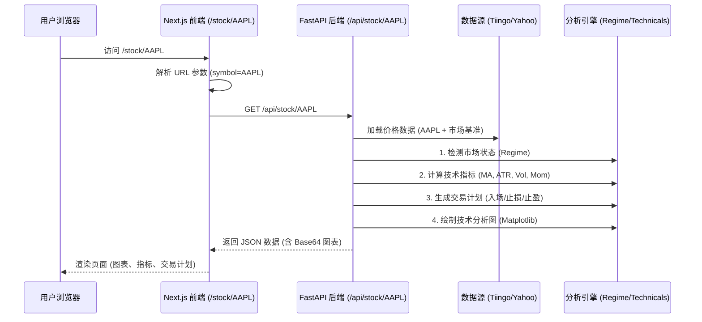

# 个股分析 API 流程详解 (Stock Analysis API Flow)

本文档详细解析 `http://localhost:3000/stock/{stockId}` 页面背后的完整数据流和分析逻辑。该页面对应从前端请求到后端深度分析的端到端过程。

## 1. 总体交互流程 (End-to-End Flow)

用户访问个股详情页时，系统执行以下交互：



---

## 2. 前端请求层 (Frontend Layer)

- **页面路径**: `src/web/src/app/stock/[symbol]/page.tsx`
- **触发机制**: 页面加载时 (`useEffect`) 自动触发。
- **请求地址**: `http://localhost:8000/api/stock/{symbol}`
- **主要职责**:
  1.  **加载状态**: 显示 "正在分析..." 加载动画。
  2.  **错误处理**: 如果后端返回 404 或 500，显示错误提示。
  3.  **数据展示**: 将后端返回的复杂 JSON 渲染为可视化的仪表盘，包括：
      - 价格与推荐标签 (强烈推荐/推荐/观望)
      - Base64 蜡烛图
      - 关键指标网格 (MA, 动量, 波动率)
      - 三级交易计划 (入场、止损、止盈)

---

## 3. 后端处理层 (Backend Processing)

- **API 接口**: `src/etf_trend/api/main.py` -> `analyze_stock`
- **处理步骤**:

### 3.1 数据准备

后端接收到请求后，首先加载目标股票（如 `AAPL`）过去 365 天的历史价格数据。同时会加载 SPY 等基准数据用于辅助计算市场状态。

### 3.2 市场状态检测 (Regime Check)

调用 `RegimeEngine` 判断当前大盘环境。

- 虽是个股分析，但系统会附带返回 `market_regime` (RISK_ON / NEUTRAL / RISK_OFF)，提示用户大环境是否适合操作。

### 3.3 实时指标计算 (On-the-fly Calculation)

后端不会依赖预计算的数据库，而是实时计算最新技术指标：

- **移动平均**: MA20, MA50, MA200
- **动量 (Momentum)**: 60 日涨跌幅 (`(Price / Price_60d - 1) * 100`)
- **波动率 (Volatility)**: 20 日年化波动率
- **ATR**: 14 日平均真实波幅，用于后续定界
- **RSI**: 14 日相对强弱指标，判断超买/超卖
- **MACD**: 12/26/9 参数，判断趋势动能
- **布林带**: 20 日均线 ± 2 倍标准差

### 3.4 逻辑判定与推荐 (Logic & Recommendation)

系统根据计算出的指标生成自然语言的推荐理由：

| 判断维度 | 逻辑条件      | 输出文案       |
| :------- | :------------ | :------------- |
| **动量** | > 15%         | "强劲动量"     |
|          | > 5%          | "良好动量"     |
|          | < -10%        | "动量较弱"     |
| **波动** | < 25%         | "低波动高质量" |
|          | > 35%         | "高波动"       |
| **趋势** | Price > MA200 | "趋势强劲"     |
|          | Price < MA200 | "趋势偏弱"     |
| **RSI**  | > 70          | "RSI 超买"     |
|          | < 30          | "RSI 超卖"     |
| **MACD** | Hist 增强     | "MACD 增强"    |

**推荐评级算法**:

```python
if Momentum > 10% AND Price > MA200:
    Rating = "强烈推荐" (Score 0.8)
elif Momentum > 5% AND Price > MA50:
    Rating = "推荐" (Score 0.6)
else:
    Rating = "观望" (Score 0.3)
```

### 3.5 交易计划生成 (Trade Plan)

计算具体的三个档位的交易价格：

- **入场 (Entry)**
  - **激进**: MA20 价格
  - **稳健**: 现价 × 0.98 (回调 2%)
  - **保守**: 现价 × 0.93 (回调 7%)
- **止损 (Stop Loss)**
  - 基于稳健入场价减去 ATR 的倍数 (2 倍/3 倍/4 倍)
- **止盈 (Take Profit)**
  - 基于稳健入场价加上 ATR 的倍数 (3 倍/6 倍/10 倍)

### 3.6 图表生成 (Chart Generation)

后端使用 `mplfinance` 库直接在内存中绘制一张专业的 K 线图：

- **内容**: 最近 90 天 K 线。
- **叠加**: MA20 (蓝线), MA50 (橙线)。
- **辅助线**: 绘制绿色的入场线、红色的止损线、蓝色的止盈线，直观展示风险回报比。
- **输出**: 图片被编码为 Base64 字符串直接嵌入 JSON 响应中，前端无需二次请求图片。

---

## 4. 响应数据结构 (JSON Response)

最终返回给前端的数据结构示例：

```json
{
  "symbol": "AAPL",
  "name": "苹果 Apple",
  "current_price": 220.5,
  "recommendation": "强烈推荐",
  "reason": "强烈推荐 | 强劲动量 (18.5%), 低波动高质量, 趋势强劲",
  "technicals": {
    "ma20": 215.3,
    "ma200": 190.2,
    "momentum_60d": 18.5,
    "atr": 4.5,
    "rsi": 72.5,
    "macd": 1.2,
    "bb_upper": 225.0,
    "bb_lower": 205.0
  },
  "entry_levels": {
    "moderate": 216.09,
    "moderate_label": "稳健入场 (回调2%)"
  },
  "stop_levels": {
    "normal": 202.59,
    "normal_label": "标准止损 (ATR×3)"
  },
  "chart_base64": "iVBORw0KGgoAAAANSUhEUgAAB..."
}
```

## 5. 总结

该 API 设计的核心特点是 **"重后端、轻前端"**。所有的金融逻辑、指标计算、甚至是图表绘制都在后端完成。前端仅负责展示数据，这样保证了核心交易逻辑的统一性和安全性，同时也方便在未来调整策略参数（如止损系数）而无需更新前端代码。
