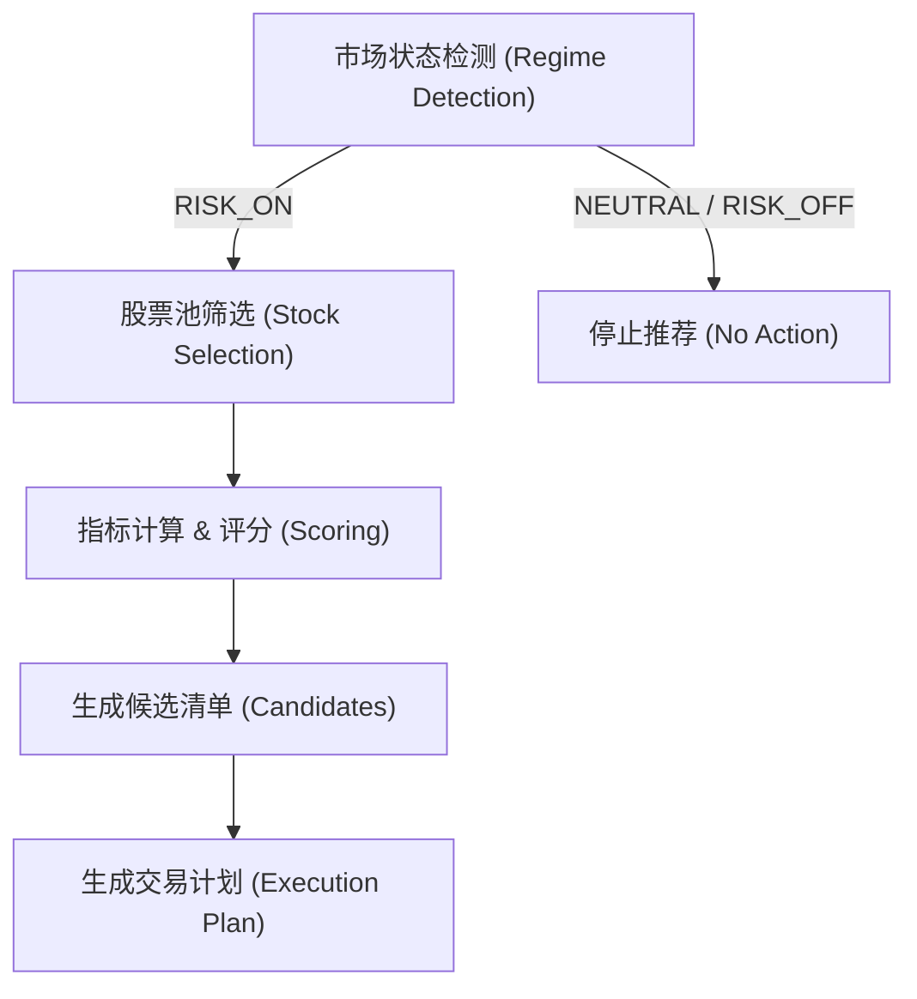

# 个股推荐与分析流程详解 (Stock Recommendation System Analysis)

本文档详细解析 `systematic-trend` 系统中的个股推荐流程（Satellite Strategy）。该策略旨在 ETF 核心配置的基础上，通过捕捉强势个股的动量效应来通过"卫星"仓位增强收益。

## 1. 核心流程概览 (Overview)

整个推荐流程是一个漏斗形的筛选过程，从宏观市场状态开始，层层递进，最终生成具体的交易计划。

---

## 2. 第一步：市场状态检测 (Market Regime Detection)

**模块**: `etf_trend.regime.engine.RegimeEngine`

这是系统的"红绿灯"。在考虑任何个股之前，必须先确定大盘环境是否安全。个股推荐仅在 **RISK_ON (风险偏好)** 状态下激活。

### 判断逻辑

系统基于以下三个核心指标加权计算市场状态：

| 指标                    | 权重    | 逻辑说明                                                      |
| :---------------------- | :------ | :------------------------------------------------------------ |
| **长期趋势 (Trend)**    | **40%** | 判断 **SPY** 价格是否在 **200 日均线** 之上。这是牛熊分界线。 |
| **市场波动 (VIX)**      | **30%** | 判断 **VIX** 恐慌指数。VIX < 20 为正常，越低得分为满分。      |
| **中期动量 (Momentum)** | **30%** | 判断 **SPY** 过去 **60 日** 的涨跌幅。正收益为正分。          |

### 输出状态

综合得分（0.0 ~ 1.0）决定最终状态：

- **RISK_ON (>= 0.6)**: 🟢 绿灯。可以积极配置个股。
- **NEUTRAL (0.4 - 0.6)**: 🟡 黄灯。观望，仅持有 ETF 核心。
- **RISK_OFF (< 0.4)**: 🔴 红灯。防守模式，禁止推荐个股。

---

## 3. 第二步：个股筛选 (Stock Selection)

**模块**: `etf_trend.selector.satellite.StockSelector`

一旦绿灯亮起，扫描器（Scanner）会对目标股票池进行严格筛选，寻找"主升浪"形态的标的。

### 3.1 股票池 (Universe)

系统关注经过筛选的优质大盘股，覆盖科技、消费、金融和医疗板块：

- **科技七巨头**: AAPL, MSFT, GOOGL, AMZN, META, NVDA, TSLA
- **稳健消费**: WMT, HD, MCD, COST, NKE
- **金融/医疗**: JPM, V, MA, JNJ, UNH, PFE

### 3.2 过滤条件 (Hard Filters)

候选股必须 **同时满足** 以下所有“硬指标”，缺一不可：

1.  **多头排列**: 当前价格 > **200 日均线** (MA200)。
2.  **正动量**: 综合动量评分 > 0。
3.  **拒绝妖股**: 年化波动率 < **60%** (0.6)。排除风险过高的标的。

### 3.3 综合评分 (Signal Strength)

通过过滤的股票会根据多因子模型评分（0.0 ~ 1.0），并在脚本中启用 `use_fundamental=True`：

1.  **动量因子 (Momentum) - 40%**
    - 综合 20 日、60 日、120 日 涨幅。
    - 权重: 短期(33%)、中期(34%)、长期(33%)。
2.  **质量因子 (Quality) - 30%**
    - _目前实现_: 使用 **低波动率** 作为质量的代理指标。
    - 逻辑: 波动越低，得分越高。优先选择涨势平稳的股票。
3.  **趋势因子 (Trend) - 30%**
    - 计算当前价格偏离 MA200 的幅度。
    - 逻辑: 乖离率适度越高，趋势越强。

### 3.4 推荐评级

- **强烈推荐**: 评分 >= 0.7
- **推荐**: 评分 >= 0.5
- **观望**: 评分 < 0.5

---

## 4. 第三步：生成交易计划 (Execution Plan)

**模块**: `etf_trend.execution.executor.TradeExecutor`

对于筛选出的每只股票，执行器会生成详细的"作战计划"，包括何时买、何时卖、何时止损。所有价位均基于 **ATR (平均真实波幅)** 动态调整，适应不同个股的股性。

### 4.1 多级入场点 (Entry Levels)

不建议现价无脑买入，而是提供三个梯度的挂单建议：

- **激进 (Aggressive)**: 参考 **MA20** 或 现价回调 **1%**。适合极其强势、不怎么回调的股票。
- **稳健 (Moderate)**: 现价回调 **2%**。系统的默认建议价。
- **保守 (Conservative)**: 现价回调 **7%**。适合大盘震荡时"捡便宜"。

### 4.2 动态止损 (Stop Loss)

个股波动大，止损必须宽于 ETF：

- **紧止损**: 入场价 - (1.5 × ATR)
- **标准止损**: 入场价 - (3.0 × ATR) _(推荐)_
- **宽止损**: 入场价 - (4.0 × ATR)

### 4.3 分批止盈 (Take Profit Targets)

基于风险回报比 (Risk:Reward) 设置目标：

- **TP1**: 入场价 + (3 × ATR) -> R:R = 1:1
- **TP2**: 入场价 + (6 × ATR) -> R:R = 1:2
- **TP3**: 入场价 + (10 × ATR) -> R:R = 1:3+

### 4.4 移动止损 (Trailing Stop)

- 当价格上涨时，止损线跟随上移。
- 距离: 最高价回撤 **2.5 × ATR**。
- 目的: 锁住利润，让利润奔跑。

---

## 5. 示例输出解析

运行脚本 `python -m etf_trend.scripts.stock_picks` 可能得到如下结果：

> **[1] NVDA (英伟达)**
>
> - **推荐理由**: 强劲动量 (85%), 趋势强劲
> - **价格**: $120.00
> - **入场**: $117.60 (稳健回调)
> - **止损**: $108.00 (ATR 保护)
> - **止盈**: $150.00 (TP3)

## 6. 总结

该流程的核心哲学是 **"顺势而为，截断亏损"**。

1.  **Regime** 确保只在好天气出海。
2.  **Selector** 确保只上好船（强势股）。
3.  **Executor** 确保有救生圈（止损）和目的地（止盈）。
